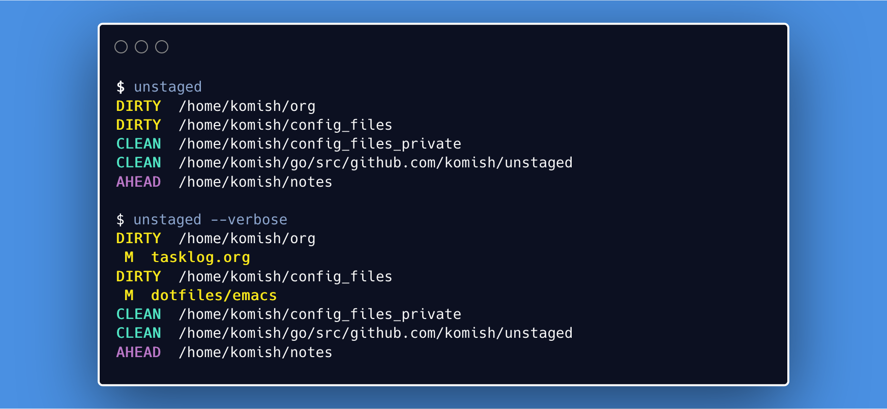

# Unstaged
Check for unstaged changes across a set of git repositories that you configure.

### Usage:

```
unstaged [--flags] [/path/to/repo]

  -h, --help      display help
  -v, --verbose   display verbose output
      --version   display version
```

You can specify the repo to check against as a command line parameter using format
`unstaged /path/to/repo` or use a `yaml` configuration file to specify the list of repos to check against.

### Configuration file:

`unstaged` looks for config file in a directory `unstaged` to be present inside user config location as returned by [`os.UserConfigDir()`](https://golang.org/pkg/os/#UserConfigDir) and must be of the following format:

```
  repos:
    - /path/to/repo/one
    - /path/to/repo/two
    - ...
```

### Screenshot:
<p align="center">
  
</p>


# License

This package is under the MIT License. See [LICENSE](LICENSE).